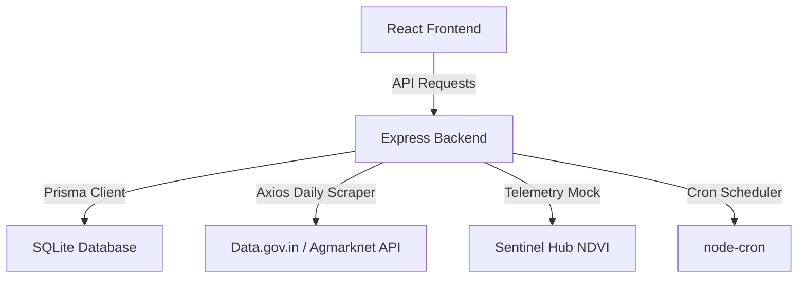

# 🌾 AgriConnect: AI-Powered Price Intelligence & Precision Agriculture

AgriConnect is a premium, production-grade Web Application designed to empower farmers and agricultural buyers with real-time price intelligence, satellite crop telemetry, and transparent Peer-to-Peer (P2P) trading.

---

## 🚀 Key Core Features

### 1. 🧠 AG-3 Price Intelligence Engine
* **Government API Integration**: Connected directly to the **Data.gov.in (Agmarknet)** portal to sync real-time mandi prices daily.
* **Modal Price Logic**: Dynamically calculates the mathematical *Modal Price* (the most frequent listing rate) instead of basic averages to prevent statistical anomalies.
* **SVG Pricing Gauge**: Custom semi-circle vector graphic indicator rendering live price deviations inside *Fair, Cautionary, or Exploitative* zones.
* **Automated Cron Jobs**: Employs `node-cron` to execute daily automated market price fetches every midnight, with a fallback database simulation pipeline if API keys are missing.

### 2. 🛰️ Precision Agriculture & AI Recommendations
* **Satellite NDVI Telemetry**: Simulates Sentinel-2 L2A satellite bands (NIR and Red) to calculate the **Normalized Difference Vegetation Index (NDVI)** and provide targeted crop watering/health warnings.
* **eNAM Supply Volume Analysis**: Monitors trading arrival quantities from the National Agriculture Market (eNAM) to predict upcoming price shifts.
  * *High supply arrivals* → Generates warnings to sell inventory before price drops.
  * *Low supply arrivals* → Suggests holding stock to maximize profits as demand surges.

### 3. 🛒 P2P Buyer Commerce Hub
* **Geographical Haversine Math**: Automatically computes the physical P2P distance in kilometers between the buyer's coordinates and the farmer's mandi location.
* **Trust Badging**: Dynamically compares listing prices with active government modal prices to flag cards with a `Verified Fair Price` or `Above Market Rate` badge.
* **Quick Contact Nodes**: Seamlessly connects buyers and sellers using direct Call and WhatsApp communication links.

---

## 🛠️ Tech Stack & System Architecture



* **Frontend**: React (Vite), Recharts, TailwindCSS
* **Backend**: Node.js, Express, Prisma ORM
* **Database**: SQLite (Development) / MySQL (Ready)
* **API Integrations**: Data.gov.in (Agmarknet), eNAM Arrivals dataset, Sentinel NDVI Satellite telemetry

---

## ⚙️ Environment Configuration

Create a `.env` file inside the `backend/` directory:

```env
DATABASE_URL="file:./dev.db"

# Official Government portal key generated from data.gov.in
DATA_GOV_API_KEY=your_gov_api_key_here
MARKET_DATA_RESOURCE_ID=9ef84268-d588-465a-a308-a864a43d0070
```

---

## 🖥️ Getting Started

### 1. Database Setup
Navigate to the `backend/` directory, install packages, and synchronize your Prisma schema:
```bash
cd backend
npm install
npx prisma db push
```

### 2. Launch the Backend Server
Start the backend Express server:
```bash
node server.js
```
*Note: The server will automatically trigger an initial startup market data synchronization to fetch the latest Agmarknet daily price records.*

### 3. Launch the Frontend Application
Navigate to the `frontend/` directory, install dependencies, and start the development server:
```bash
cd ../frontend
npm install
npm start
```
Open [http://localhost:3000](http://localhost:3000) to view the application.

---

## 🔌 API Reference Endpoints

| Endpoint | Method | Description |
| :--- | :--- | :--- |
| `/api/market/update-prices` | `GET` | Manually triggers the Data.gov.in Agmarknet prices fetcher |
| `/api/market/daily-prices` | `GET` | Retrieves the latest 30 daily Mandi price records |
| `/api/market/recommendation/:farmerId` | `GET` | Computes AI crop suggestions based on eNAM volume levels |
| `/api/market/satellite-ndvi` | `GET` | Returns Sentinel-2 simulated vegetation density metrics |
| `/api/products/all` | `GET` | Fetches active crop listings with buyer-to-farmer distance calculations |
